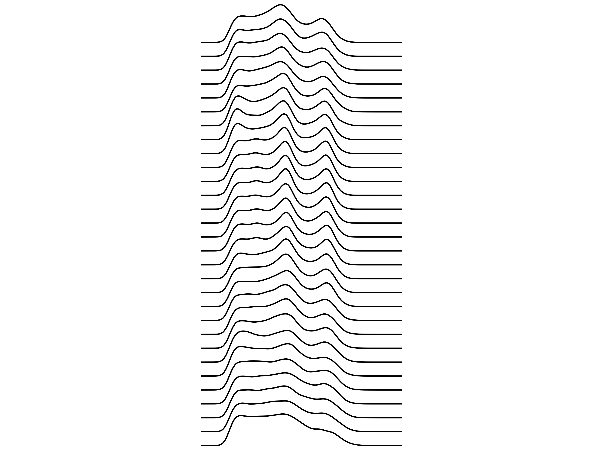

# joyPlot
Takes .wav files and makes "Joy Plots" out of them!

A "joy plot" is a type of data visualization popularized/named after the band Joy Division thanks to the album art for their album _Unknown Pleasures_ https://en.wikipedia.org/wiki/Unknown_Pleasures. The image on the cover is a bunch of stacked signals from a pulsar https://en.wikipedia.org/wiki/PSR_B1919%2B21. I thought that this idea was really cool, so I made a script to generate joy plots out of whatever .wav files I could find.

Please note: it's probably best to give this script signals that have a set frequency that's in a whole number of Hertz, because it will process that audio by each _x_ seconds, where x is variable.

Here's an example of a plot made by a sound I recorded from a passing satellite, broadcasting an APT signal:

And here's a plot of the level of chlorophyll/phytoplankton in the southern hemisphere over time!

# Usage

`python joyPlotter [name of a file in /wavs]`

This will deposit a .png plot into the plots folder.

# Requirements

Weirdly, we have a lot:

1. Python
2. Numpy
3. Scipy
4. Matplotlib
5. Pandas
6. Joypy
